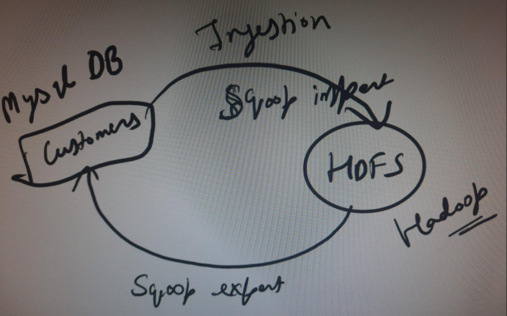

# Overview of Hadoop

Hadoop is a framework to solve big data problems

2007 - Hadoop 1.0
2012 - Hadoop 2.0
current varsion - Hadoop 3

## 3 core components
- HDFS / Mapreduce / YARN

    ### HDFS
    - Hadoop distributed file system (Distributed Storage : it is the way we store the data)

    ### Mapreduce
    - Distributed processing

    ### YARN
    - Yet another resource negotiator (Resource manager)

    - writing a mapredurce code is really hard - Java(Obsolete)

## technologies outside Hadoop ecosystem (these are used to make our life easier)
- Scoop, Pig, Hive tech stacks are part of mapreduce
    ### Scoop
    - 
    - for data movement
    - will learn Azure Datafactory

    ### Pig
    - scripting language, mainly used to clean the data..

    ### Hive
    - provide a sql kind of interface to query your data

    ### HBase
    - is a nosql database 
    - if you need the data faster for a single record then use no sql
    - we will learn cosmos db

    ### Oozie
    - workflow scheduler
    - cloud alternative (Azure data factory)

## Challenges with Hadoop
- Mapreduce is slow and its really hard to write the code
- we need to learn so many different components and each has its own big learning curve..
- On-premise

## What we have learn't from this
- What is Hadoop
- core components of Hadoop
- some of ecosystem technologies
- challenges of Hadoop

