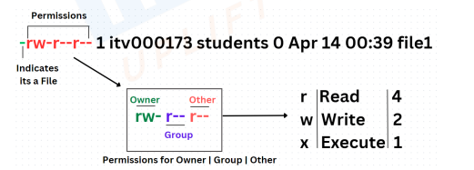
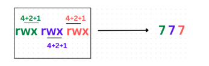

# Linux Commands - cd & ls
- **cd** : Change Directory is used to change the current directory and to move
inside sub-directories.
 - **ls** : It is used to display the list of files and sub-directories in the current
directory
    - *blue* represents directories
    - *green* represents executables
    - *black* denotes normal files
- **touch** : Is used to create an empty file.
- **ls -ltr** : to view the file created
     - 
- **chmod** : Command to change the permissions
    - chmod 777 file1 - This command is used to change the permissions of
a file, so that it is readable, writable, and executable (rwx) by all users. It
will give all the permission to all as -rwxrwxrwx
    - 
- ls
